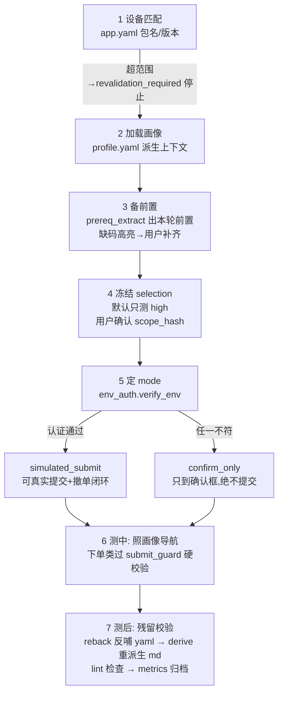

# sixgill 项目说明文档

> 本文基于对仓库全部源码、配置、文档的逐一阅读整理（2026-08-09 初版；2026-08-13 刷新至 `runs/2026-08-10-test-cases`、profile.yaml 258 行版；2026-08-16 修复 §七-8 后全绿），测试套件实测 **161 passed**。
> 读者对象：接手该项目、想快速看懂"每个文件干什么、系统怎么跑起来"的工程师。

---

## 一、这个项目是什么

**sixgill 是一个「AI 驱动 Android 真机做业务自测」的系统**，首个落地场景是：用 AI（Claude Code）驱动真实手机，把国金证券 App（同花顺白标，包名 `com.hexin.plat.android.GuoJinZXGSecurity`）的 753 行「北交所 ETF」Excel 测试用例自动跑一遍，产出带回填结果和内联截图的标注 Excel。

它不是一次性脚本，而是从 2026-07-28/29 几天实跑沉淀升级出的**多 App 自测底座**，设计目标（见 `docs/superpowers/specs/` 的系统设计 v5）：

1. **可进化**——每次测试的新发现结构化反哺回"App 画像"，越用越快，同 App 不重复踩坑；
2. **可复现/可归档**——每轮测试有机读清单、截图证据、token 成本台账；
3. **安全可控**——系统会驱动**真实（模拟盘）交易委托**，因此内建一整套程序化硬安全边界（环境认证、逐笔提交校验、撤单闭环、恢复状态机）；
4. **可复用/可分发**——工具和流程跨 App 通用，换券商只需建 `apps/<新app>/` 数据目录；已跑通的链路固化成 Maestro 脚本，无 AI 也能回归。

一句话理解其独特性：**它把"AI 操作手机跑交易类用例"这件高风险的事，拆成了「数据契约（YAML+JSON Schema）+ 纯函数安全判定（可单测）+ AI 技能流程（SKILL.md）+ 硬护栏 hook」四层**，且全部逻辑有 pytest 覆盖。

---

## 二、目录结构总览

```
sixgill/                        # 项目根（多 App 自测之家）
├── 自测经验总结.md              # ★ 方法论总纲：工作流/血泪坑/分档口径/入口地图/性价比
├── 草稿.md                     # 新入口速记暂存（2026-08-10 股指/A股条目先记这里，再写入 profile.yaml）
├── pyproject.toml              # pytest 配置（pythonpath=["."]）
├── requirements.txt            # PyYAML / jsonschema / pytest
├── .gitignore                  # 忽略 .secrets/、runs/**/snapshots/、*.private.png
│
├── apps/guojin/                # ★ 单个 App 的家（国金证券）：YAML 机器权威 + MD 派生
│   ├── app.yaml                #   App 身份/包名/版本兼容区间/测试账户(脱敏别名)
│   ├── env.yaml                #   环境认证（当前=轻量档 trusted_internal，声明即信任模拟盘）
│   ├── env.yaml.example        #   严格路径(operator_attested+签名)的填写样例（休眠用）
│   ├── profile.yaml            #   ★机器权威：入口地图/能力矩阵/已验证链路（带验证元数据）
│   ├── prerequisites.yaml      #   ★机器权威：账户能力/标的属性/已知代码(attributes 词表)
│   ├── 画像.md / 前置条件.md / 速览.md   # 全部由 derive_docs.py 从 yaml 派生，勿手改
│
├── tools/                      # ★ 全部可执行工具（跨 App 共用）
│   ├── droid.py                #   adb+uiautomator 真机驱动 CLI（AI 操作手机的唯一入口）
│   ├── annotate_excel.py       #   结果回填 Excel：追加 AI 列 + 内联截图 + 分档函数
│   ├── metrics.py              #   token/成本统计（按会话 transcript 时间窗）+ 上下文税提醒
│   ├── prereq_extract.py       #   CLI：从用例集派生「本轮前置」(缺码高亮)
│   ├── prereq_rules.yaml       #   前置规则表（9 条，带极性，机器权威，跨 App）
│   ├── derive_docs.py          #   yaml → 画像.md/前置条件.md/速览.md 派生器
│   ├── reback.py               #   测后结构化 upsert 反哺（写盘前 schema 校验）
│   ├── lint_profile.py         #   一致性 lint：重复 key/跨产物复制/stale/md-yaml 漂移
│   ├── contracts/              #   契约层：validate.py + 9 个 JSON Schema
│   ├── prereq/                 #   前置引擎核心：rules.py / extract.py / metrics.py
│   └── safety/                 #   交易安全纯函数：env_auth/env_sign/secrets/
│                               #     non_marketable/submit_guard/recovery
│
├── .claude/                    # Claude Code 集成
│   ├── settings.json           #   注册 PreToolUse(Bash) hook
│   ├── hooks/guard_git_add.py  #   硬护栏：拦 git add ./秘密路径（fail-closed）
│   ├── hooks/context_tax_reminder.py  # 上下文税阈值提醒纯函数（被 metrics.py 复用）
│   └── skills/app-selftest/    #   ★ 主技能：SKILL.md + references/ 5 份
│
├── cases/                      # 从 Excel 提炼的 high 优先级用例清单（green/yellow 两档）
├── maestro/                    # 9 条已跑通「下单→撤单」链路的 Maestro 固化 flow + README
├── runs/                       # ★ 每轮实跑的归档：report.md + shots/ + 时间戳 + 动作日志
│   └── metrics.md              #   跨批次的性价比总台账
├── tests/                      # pytest 套件（161 个测试）+ fixtures（valid/invalid 样本）
├── docs/superpowers/           # 设计文档：1 份系统设计 spec + 3 份实施 plan + 1 份 spike
├── .secrets/                   # git-ignored：完整账号映射、HMAC 密钥（仓内只有 README）
└── .superpowers/sdd/           # 三份 plan 的子代理执行工件（progress/brief/report/diff）
```

---

## 三、运行原理

### 3.1 两种执行形态

| 形态               | 驱动方式                                                            | 适用场景                  | 成本                               |
| ---------------- | --------------------------------------------------------------- | --------------------- | -------------------------------- |
| **AI 实时驱动**      | Claude Code 按 `app-selftest` skill 流程，调 `tools/droid.py` 逐步操作真机 | 探索性/取证类用例（看字段、看列表、截图） | output-only 约 $0.41/用例（一屏多用例合并后） |
| **Maestro 固化回归** | 已验证链路写成 `maestro/*.yaml`，`maestro test` 直接跑                     | 下单/撤单等确定性强的回归         | 无 AI 成本                          |

方法论共识（`自测经验总结.md` §五）：**探索/取证类用 AI 最划算，下单回归类固化 Maestro 最省钱**。

### 3.2 AI 驱动的主工作流（已跑通）

```
解析Excel(分档) → 按"屏"分组用例 → 串行驱动手机(一屏多用例)
  → 元素树断言(droid has/find) + 截图取证(shot) → 回填 tested 字典
  → 重跑 annotate_excel.py 生成标注 Excel → metrics.py 记性价比
```

关键纪律：断言用 `droid.py has "关键词"`（退出码判断，绕开终端 GBK 乱码）；坐标不硬记，每次交互后重新 `find` 取；入口试 ≤2 次找不到就标"入口待确认"跳过；下单提交必须连贯（`tap 买入 → sleep 1.5 → tap 确认`，中间不夹截图/dump，否则触发客户端「请勿重复提交」防重锁使委托作废）。

### 3.3 一次自测的完整生命周期（SKILL.md 规定的 7 步）



### 3.4 「YAML 机器权威 + MD 脚本派生」的数据闭环

这是全项目最重要的架构决策（spec §二）：**结构化信息（入口/能力/链路/前置/规则）的权威源是 YAML，Markdown 只是给人读的派生物**。

```
profile.yaml ─┐
              ├─ derive_docs.py ─→ 画像.md / 前置条件.md / 速览.md（首行 banner 注明勿手改）
prerequisites.yaml ─┘
      ↑
      └─ reback.py（测后按 key/alias/code 结构化 upsert，写盘前 schema 校验，失败不写）
      ↑
lint_profile.py（查重复/跨产物复制/stale>30天/md 与 yaml 漂移）
```

好处：schema 校验、唯一键、stale 查询、upsert 都在 YAML 层做；MD 永不承担结构化职责，改了也会被 lint 抓出"漂移"。

### 3.5 交易安全体系（P0，纯函数、全部可单测）

因为系统会点"确认买入"驱动**真实委托**，安全层是整套程序化判定（`tools/safety/`，与设备 I/O 解耦）：

**① 三级交易模式**

| 模式                 | 含义                               | 状态                                                                  |
| ------------------ | -------------------------------- | ------------------------------------------------------------------- |
| `confirm_only`     | 只驱动到确认框，**绝不点最终确认**（零真实提交，天然不成交） | 默认降级态                                                               |
| `simulated_submit` | 环境认证通过时允许自主提交+撤单闭环               | **测试运营默认**                                                          |
| `live_submit`      | 真实生产交易                           | **仅入 schema/策略，执行路径未实现**（`safety_constraint` schema 的 mode 枚举主动排除它） |

**② 环境认证 → mode 推导**（`env_auth.verify_env`）：两条路径——

- `trusted_internal`（**现行默认，2026-07-30 简化**）：团队内已知模拟盘，声明即信任。只查基础卫生：未撤销 ∧ `type: simulation` ∧ 包名匹配 ∧ 版本在区间 → `simulated_submit`，**不要求 HMAC 签名/署名/有效期**。`revoked: true` 是一键锁死开关。
- `operator_attested` / `technical_verified`（**严格路径，休眠**，将来测真账户/生产才启用）：另需 HMAC 签名（`integrity_ok`）+ 真实署名（占位名如 `EXAMPLE-OPERATOR`/`PENDING_*` 会被判 `attestation_placeholder` 拒绝）+ 有效期未过。

任一校验不符 → **自动回退 `confirm_only`**。

**③ 逐笔提交硬校验**（`submit_guard.guard_submit`，在点"买入/卖出"**之前**用下单页可读字段判定）：

1. `mode=confirm_only` → 短路拒绝（`mode_confirm_only`）
2. 字段缺失 → 短路拒绝（`field_missing`）
3. 累积校验：账户 HMAC∈白名单 ∧ 代码∈`code_allowlist` ∧ 数量为正整数且≤`qty_max` ∧ 价格过 `non_marketable` 判定；未知 `price_rule` fail-closed 拒绝。

**④ `non_marketable` 非主动成交判定**（`non_marketable.check_non_marketable`）：行情时间戳超过 `max_staleness_s` 拒绝；买单 `price < 卖1`（无卖盘时须 `== 跌停价`）；卖单 `price > 买1`（无买盘时须 `== 涨停价`）。这就是 Maestro flow 里"跌停价买/涨停价卖，挂单必不成交、可撤单、账户零残留"策略的程序化表达。

**⑤ 撤单闭环与恢复状态机**（`recovery.plan_recovery`）：提交后崩溃/断网/结果未知时，按 `合同号`（精确）或 `代码+方向+数量+价格(±1e-6)+提交时间(±120s)`（模糊）在当日委托里找本轮残留：唯一匹配且非终态（已报/未报/部成/可撤）→ 列入撤单；**多匹配歧义 → STOP 转人工**，禁止盲目重试。撤单成功终态 = `已撤`/`部撤`（测试环境不区分）。

**⑥ `BLOCKED_ENVIRONMENT`**：环境降级导致无法真实提交/撤单的用例，独立标记、**不计入通过率**（既不算过也不算败），报告显式提示。

### 3.6 前置条件引擎（测前一次性备齐测试数据）

解决"测到一半发现要某个状态的标的/权限，反复打断"的痛点。

- **规则表** `tools/prereq_rules.yaml`（version 1，9 条，机器权威，跨 App 用 `applies_to` 限定）：每条规则 = `match`（标题关键词 all/any/none 匹配）+ `requires`（需要的标的属性/账户类型）+ **极性 polarity 三分**：`positive`（需属性为真）/ `negative_property`（需负向属性做数据，如"非融资标的"用于预期失败测试，带 `expected_capability`）/ `no_prereq`（显式无需前置）。刻意不做字符串否定判断，避免"融资买入"误命中"非融资标的"。
- **匹配**（`prereq/extract.py`）：一用例命中多规则按 `priority` 取主规则；`matched_rule_ids` 记全部命中（可追溯）；命中规则 `requires.instrument` 做属性并集；同键异值 → 标 `conflict` 交人工；全不命中 → 显式进 `unidentified` 列表（不静默丢）。
- **解码**（`prereq_extract.py` CLI）：对需备码用例，用 `prerequisites.yaml` 的 `known_codes[].attributes` 做**属性子集匹配**解出 `needed_codes`；解不出 → `⚠️缺码` 高亮进 `missing_codes`。产出 `本轮前置.yaml`（过 `prereq_request` schema）+ 派生 `.md`（分"需备码/无需前置/未识别/冲突"四区）。
- **验收**（`prereq/metrics.py`）：spike 用国金 728 合成金标（含 3 条 paraphrase/对抗用例防过拟合）卡阈值门：召回 ≥0.9、误报 ≤0.34、极性正确率 =1.0、追溯完整性 =1.0。注意该金标是蒸馏合成 fixture（仓内无 Excel 原件），裁决的是引擎机制而非真实语料召回。

### 3.7 度量与"上下文税"

- `tools/metrics.py` 从 Claude Code 会话 transcript（jsonl）按时间窗统计 token：`output`（最代表真实工作量）/ `cache_read`（每轮重读上下文的"税"）等，按假设单价（input $15 / output $75 / cache_read $1.5 / cache_creation $18.75 每百万）估算成本。子命令 `now`（打 UTC 时间戳，runs 里的 `T0.txt`/`T1.txt`/`start.txt` 就是时间窗标记）/ `tokens SINCE UNTIL` / `session`。
- **D2 决策**（`docs/superpowers/spikes/2026-07-29-hook-context-tax-feasibility.md`）：经调研确认 Claude Code hook 的 stdin payload **不含实时 token/cache**，拿不到"当前用量"，故上下文税护栏降级为——`metrics.py` 每批算完后调用 `.claude/hooks/context_tax_reminder.py` 的 `assess()` 纯函数，超阈值（turns>40 / actions>60 / 时长>30min）打印"考虑新开精简会话/固化 Maestro"。**不接 Stop hook**（payload 没有 metrics 字段，接了永不发声=伪护栏）。
- 实测结论（`runs/metrics.md`）：超长会话 cache_read 可累积到 22.7M~59.3M token（含税成本虚高 2.5~3.9 倍），故"新开精简会话"和"固化 Maestro"是压成本的两条正路；`droid.py` 设 `DROID_LOG` 环境变量会记动作日志（runs 里的 `actions.log`），供 metrics 统计动作数。

### 3.8 秘密隔离体系

- **仓内只存别名+脱敏尾号**（pt/`***5183` 普通账户、xy/`***2927` 信用账户）；完整账号只在 `.secrets/guojin.accounts.yaml`（git-ignored）。
- `.gitignore`：`.secrets/*`（仅 `README.md` 与 `*.example` 例外入仓）、`runs/**/snapshots/`、`*   .private.png`。
- **hook 硬护栏** `guard_git_add.py`（PreToolUse 拦 Bash）：拦 `git add .`/`-A`/`--all`/`-u`/`*`/magic pathspec，拦触及 `.secrets/`/`snapshots/`/`*.private.png` 的 add（白名单例外与 .gitignore 镜像一致）；能识别复合命令（`&&`/`;` 分隔逐段判定）、`git.exe`/全路径 git、全局选项夹带（`-C`/`-c`/`--git-dir=`）等绕过手法；stdin 显式按 UTF-8 解码（防 Windows GBK 误解码）；**读不到 payload 也拦截（fail-closed）**。
- **schema 层防呆**：`prerequisites` schema 用 `additionalProperties:false` + `mask` 正则 `^\*{2,}[0-9]{2,4}$`，从契约上禁止完整账号字段。
- **测试哨兵**（`tests/conftest.py` 的 `forbidden_full_accounts` fixture）：从 git-ignored 的真实账号文件读真号，断言各受控产物不含真号——且刻意不在测试源码里字面写真号（否则测试自身又泄漏）。

---

## 四、逐文件说明

### 4.1 根目录

| 文件                 | 作用                                                                                                                                                   |
| ------------------ | ---------------------------------------------------------------------------------------------------------------------------------------------------- |
| `自测经验总结.md`        | **方法论总纲**（105 行）。已跑通工作流、droid.py 用法、9 条血泪坑（乱码/FLAG_SECURE/坐标漂移/防重锁等）、分档口径（只有"需测试数据"和"需交易时段"两个降级判据）、国金入口地图（含 resource-id）、性价比经验、skill 化评估。是后续所有设计的源头。 |
| `草稿.md`            | 新入口速记暂存：探索发现的新路径先记这里再写入 profile.yaml（2026-08-10 的股指/沪深京A股条目即由此流入）——当前画像"草稿→正式"人工生长工作流的一环，也是 §八 自动生成要取代的环节。                                           |
| `pyproject.toml`   | 仅配 pytest：`pythonpath = ["."]`，使测试能 `import tools.*`。                                                                                                |
| `requirements.txt` | `PyYAML>=6.0`、`jsonschema>=4.0`、`pytest>=8.0`。注意：`annotate_excel.py` 用的 `openpyxl` 未列入（属一次性回填脚本，见"已知小问题"）。                                           |
| `.gitignore`       | 忽略 `.secrets/*`（例外：README.md、*.example）、`runs/**/snapshots/`、`*.private.png`、`__pycache__`。与 hook 白名单两处镜像一致。                                         |

### 4.2 `apps/guojin/` —— 国金证券 App 的数据家

| 文件                   | 作用                                                                                                                                                                                                                                                                                                                                           |
| -------------------- | -------------------------------------------------------------------------------------------------------------------------------------------------------------------------------------------------------------------------------------------------------------------------------------------------------------------------------------------- |
| `app.yaml`           | App 身份卡：slug/别名/包名 `com.hexin.plat.android.GuoJinZXGSecurity`/`verified_versions`（8.05.001@2026-07-29）/兼容区间 `[8.05.001, 8.06.000)`/测试账户别名（pt 普通 `***5183`、xy 信用 `***2927`）/对 env、profile、prerequisites 三个文件的引用。执行前用设备实际包名/版本匹配，超范围→`revalidation_required` 停止。                                                                               |
| `env.yaml`           | **环境认证（当前生效档）**：`type: simulation` + `assurance_level: trusted_internal` + 包名/版本区间/账户别名 + `revoked: false`——轻量档声明即解锁 `simulated_submit`，无需签名。改 `revoked: true` 即锁死回退 `confirm_only`。                                                                                                                                                         |
| `env.yaml.example`   | 严格路径（`operator_attested` + HMAC 签名）的填写样例，供将来测真账户照抄。占位名 `EXAMPLE-OPERATOR` 会被 `verify_env` 判 `attestation_placeholder` 回退——即使改名也达不到 `simulated_submit`（防"假认证"绕过）。不被执行流读取。                                                                                                                                                                     |
| `profile.yaml`       | ★**机器权威画像**（258 行）：`entries[]` 16 条入口地图（普通买卖撤/闪电买卖/新三板买撤/大宗/两融/两融撤/行情详情/简报价/IOPV/ETF列表/股指/沪深京A股列表，每条带完整 resource-id 导航串）、`capabilities[]` 22 条能力矩阵（含"不支持"项：闪电市价❌、闪电两融❌、新三板大宗❌、跟踪指数❌、个股分时行业板块❌（9.02.10 实测）、融资买入无标的 unverified 等）、`verified_chains[]` 9 条已验证下单→撤单链路（带合同号证据）。每条记录带 `last_verified`/`app_version`/`evidence_run`/`status` 验证元数据。 |
| `prerequisites.yaml` | ★**机器权威前置**：`account_capabilities`（2 账户能力）、`instrument_properties`（12 标的人读属性串）、`known_codes`（12 标的的引擎权威 `attributes` 词表：`market/product/t0/has_nav/has_holding/orderbook_depth/collateral_eligible/financing_eligible/in_subscription`——键名必须与 `prereq_rules.yaml` 的 `requires.instrument` 对齐，否则解不出码）。                                        |
| `画像.md`              | 派生物（勿手改）：功能支持矩阵表 + 入口地图 + 已验证链路。                                                                                                                                                                                                                                                                                                             |
| `前置条件.md`            | 派生物（勿手改）：账户能力表 + 已知代码表 + 标的属性表。                                                                                                                                                                                                                                                                                                              |
| `速览.md`              | 派生物（勿手改）：一页速查（核心入口状态/核心码/已验证链摘要）。                                                                                                                                                                                                                                                                                                            |

### 4.3 `tools/` —— 工具层

**设备驱动与结果回填：**

| 文件                  | 作用                                                                                                                                                                                                                                                                                                                                  |
| ------------------- | ----------------------------------------------------------------------------------------------------------------------------------------------------------------------------------------------------------------------------------------------------------------------------------------------------------------------------------- |
| `droid.py`          | **AI 操作真机的唯一入口**（156 行，零第三方依赖，直接 subprocess 调 adb，规避 Git Bash 路径改写）。子命令：`current`（前台 activity）/ `screen`（dump 元素树打印可交互元素）/ `find "文字"`（定位元素+坐标）/ `has "词"...`（断言，退出码 0/1，**断言首选**）/ `tap --text/--id/--xy` / `type`（仅数字/ASCII，中文不行）/ `key BACK...` / `swipe` / `shot`（截图，0 字节会提示 FLAG_SECURE）。设 `DROID_LOG` 环境变量即记动作日志供 metrics 统计。 |
| `annotate_excel.py` | **结果回填器**：内置 `tested` 字典（(sheet,用例名)→(状态,实测描述,证据图路径)，承载两轮实跑的全部结论）和 `tierof()` 分档函数（iOS→⬜；命中测试数据/副作用关键词→🟡；否则🟢）。读原始 Excel 每个 sheet，右侧追加 5 个"🤖AI"列（档位/状态/实测结果/证据/时间），状态着色，证据截图**内联嵌入**单元格（150px 宽、按 1260×2844 比例加高行），再生成"🤖AI自测说明"汇总页。输出新文件不改原件，目标被占用自动改名兜底。                                                                        |
| `metrics.py`        | token/成本统计（见 §3.7）。`PROJECT_DIR` 硬编码了原机的 transcript 目录（可用 `CC_TRANSCRIPT` 环境变量覆盖）。D2 接线：算完一批调 `remind()` → 动态加载 `context_tax_reminder.assess` 打印阈值提醒。                                                                                                                                                                               |

**前置条件引擎：**

| 文件                  | 作用                                                                                                                                                                                                                                                                                                |
| ------------------- | ------------------------------------------------------------------------------------------------------------------------------------------------------------------------------------------------------------------------------------------------------------------------------------------------- |
| `prereq_rules.yaml` | 规则表（9 条，见 §3.6）。每条带 `provenance`（出处，如"国金728实测:需求清单#4"）和 `confidence`。                                                                                                                                                                                                                             |
| `prereq_extract.py` | CLI 入口：`python tools/prereq_extract.py --cases cases.yaml --rules tools/prereq_rules.yaml --prerequisites apps/guojin/prerequisites.yaml --out-yaml 本轮前置.yaml --out-md 本轮前置.md`。做属性子集匹配解 `needed_codes`、缺码判定（`no_prereq`/`unknown` 永不判缺码）、产出过 schema 的 yaml + 四分区 md。开头注入仓根到 `sys.path` 使脚本可独立运行。 |
| `prereq/rules.py`   | `load_rules`（过 schema + 规则 id 唯一性校验，重复抛错）/ `index_rules` / `rules_for`（按 app+market 过滤）。                                                                                                                                                                                                          |
| `prereq/extract.py` | 核心匹配：`case_text`/`match_rule`（all/any/none 关键词）/`extract`（极性三分、优先级取主、属性并集 `_merge_instruments`、union 级冲突检测 `_instrument_conflict`/`_account_conflict`、未识别显式化、全命中追溯）。                                                                                                                              |
| `prereq/metrics.py` | 验收指标 `score(request, gold, rules_doc)`：recall / false_positive_rate / unidentified_count / manual_supplement / polarity_accuracy / traceability（完整性门：identified 用例的属性并集必须==全部命中规则的属性并集）。                                                                                                          |

**契约层：**

| 文件                                | 作用                                                                                                                                                                                                                                                                                                                                                   |
| --------------------------------- | ---------------------------------------------------------------------------------------------------------------------------------------------------------------------------------------------------------------------------------------------------------------------------------------------------------------------------------------------------- |
| `contracts/validate.py`           | 统一校验入口：`validate(doc, schema_name) -> list[str]`（错误列表，空=通过）、`load_and_validate(path, schema_name)`。用 `jsonschema` Draft 2020-12，schema 名=文件名去 `.schema.json`。                                                                                                                                                                                        |
| `contracts/schemas/*.schema.json` | 9 个数据契约：`app`（身份/版本/账户脱敏）、`env`（环境认证，assurance_level 枚举含 `trusted_internal`，严格档的署名/日期字段已降为可选）、`profile`、`prerequisites`（禁完整账号：`additionalProperties:false` + mask 正则）、`run`（机读清单）、`selection`（可审计范围）、`safety_constraint`（本轮安全约束，mode 枚举**只含** confirm_only/simulated_submit——`live_submit` 在契约层被排除）、`prereq_rules`（带极性规则表）、`prereq_request`（本轮前置输出）。 |

**交易安全（全部纯函数，见 §3.5）：**

| 文件                         | 作用                                                                                                                                                                                                                                                                                     |
| -------------------------- | -------------------------------------------------------------------------------------------------------------------------------------------------------------------------------------------------------------------------------------------------------------------------------------- |
| `safety/env_auth.py`       | `verify_env(env, device_pkg, device_version, now_iso, integrity_ok) -> (mode, reasons)`：双档路径（trusted_internal 轻量 / operator_attested·technical_verified 严格休眠）；基础卫生四项（revoked/not_simulation/package_mismatch/version_out_of_range）两档共查；严格档加查签名/有效期/占位署名黑名单。`version_in_range` 做点分数值比较。 |
| `safety/env_sign.py`       | 认证签名器：`load_key` 读 `.secrets/hmac.key`；`sign(env_yaml, key, write_sig=True)` 对 env.yaml 正文算 HMAC-SHA256 写 `.sig`。供负责人在严格路径下签名（执行程序不得自签）。                                                                                                                                               |
| `safety/secrets.py`        | `account_hmac`（账户号→HMAC 摘要，约束文档只存摘要）/ `env_integrity_ok`（HMAC 恒定时间比对防篡改）/ `is_git_committed`（git porcelain 检测，拒用未提交认证变更，兜底策略）。                                                                                                                                                         |
| `safety/non_marketable.py` | `check_non_marketable(...)`：行情新鲜度 + 买价<卖1（无卖盘=跌停）/卖价>买1（无买盘=涨停），`math.isclose` 容差处理浮点。                                                                                                                                                                                                 |
| `safety/submit_guard.py`   | `guard_submit(order, account_hmac, constraint, quote_ctx, now_ts)`：两段短路（mode/字段）+ 累积校验（账户/代码/数量/价格规则分派），未知 price_rule fail-closed。                                                                                                                                                     |
| `safety/recovery.py`       | `plan_recovery(run_orders, today_orders, window_s=120)`：合同号优先精确匹配，否则五要素模糊匹配；多匹配→STOP 转人工；唯一匹配且可撤→CANCEL 列表。注释明确假设 today_orders 是单账户快照。                                                                                                                                                 |

**画像生命周期工具：**

| 文件                | 作用                                                                                                                                                                                                                                                                                                                                            |
| ----------------- | --------------------------------------------------------------------------------------------------------------------------------------------------------------------------------------------------------------------------------------------------------------------------------------------------------------------------------------------- |
| `derive_docs.py`  | `derive(app_dir) -> {文件名: 内容}`：读 profile/prerequisites 两 yaml 纯字符串渲染三份 md（确定性、幂等），首行固定"勿手改" banner；`main(app_dir)` 写盘。只渲染 yaml 里已有的脱敏 mask，不接触完整账号。                                                                                                                                                                                           |
| `reback.py`       | `upsert(doc, section, entry)`：按 `SECTION_ID_FIELD` 声明的标识字段（entries/capabilities/verified_chains→`key`，account_capabilities→`alias`，instrument_properties/known_codes→`code`）合并；标识字段缺失 **fail closed 抛错**（防误覆盖第一条记录）；⚠浅合并语义——嵌套 dict（如 attributes）整块替换，调用方须传全量。`reback_run(profile_path, prereq_path, results)`：合并后写盘前双 schema 校验，任一失败两个文件都不写。 |
| `lint_profile.py` | `lint(app_dir, today)` 四项检查：①section 内重复标识 ②跨产物复制（同 key 既在 entries 又在 verified_chains）③stale（`last_verified` 超 30 天但 status 未标 stale；日期缺失/不可解析也报）④md-yaml 漂移（复用 `derive_docs.derive` 比对磁盘 md，不一致=疑似手改）。`today` 注入保证可复现。                                                                                                                       |

### 4.4 `.claude/` —— AI 集成层

| 文件                                           | 作用                                                                                                                                                  |
| -------------------------------------------- | --------------------------------------------------------------------------------------------------------------------------------------------------- |
| `settings.json`                              | 注册唯一一个 hook：PreToolUse 匹配 Bash → 跑 `guard_git_add.py`。                                                                                              |
| `hooks/guard_git_add.py`                     | git add 硬护栏（详见 §3.8）。`decide(command) -> (allow, reason)` 纯函数可单测，`_main` 是 hook 外壳（阻断=exit 2 + stderr）。                                             |
| `hooks/context_tax_reminder.py`              | `assess(metrics, thresholds) -> list[str]` 纯函数（默认阈值 turns 40/actions 60/minutes 30）。**故意不接 Stop hook**；`_main` 仅为手动 CLI。被 `tools/metrics.py` 复用。    |
| `skills/app-selftest/SKILL.md`               | **主技能**（触发：给一份 Excel 用例 + 一个 Android App 要 AI 驱动自测）。内容=7 步生命周期（§3.3）+ 护栏指引 + 薄索引（不内联坐标，坐标运行时 `droid find` 动态取）。                                     |
| `skills/app-selftest/references/workflow.md` | 主工作流 + 工具清单表 + 环境自检（adb devices / PYTHONUTF8=1 / FLAG_SECURE 已关）。                                                                                   |
| `references/tiering.md`                      | 分档口径：默认只测 high（low/middle 只捎带记 incidental、不计承诺覆盖）、两个降级判据、`BLOCKED_ENVIRONMENT` 呈现规则。753 行样本分布：🟢33%/🟡64%；high 389 行：🟢39%/🟡60%。                   |
| `references/pitfalls.md`                     | 14 条血泪坑清单（通用坑 + 国金专属坑），每条带现象和解法——换 App/换版本时重点核对。                                                                                                    |
| `references/safety-policy.md`                | **交易安全策略权威文档**（465 行）：三级模式、env 认证逐项校验表、submit-guard 五阶段判定顺序、撤单闭环定义、恢复状态机匹配规则、防篡改双策略（HMAC/git 未提交）、停止条件清单、模式转移图。含 2026-07-30 trusted_internal 简化的补记。 |
| `references/onboarding.md`                   | 接入指南：同 App 新需求（给 Excel+备码即可）/ 换 App（建 apps/<slug>/ 骨架+认证一次，国金是同花顺白标可对照）/ 对外分发三形态（模板仓/skill/Maestro flow 包）+ 分发前硬前置（历史脱敏、各自认证）。                      |

### 4.5 `cases/` —— 用例清单

| 文件               | 作用                                                     |
| ---------------- | ------------------------------------------------------ |
| `high_green.md`  | high 优先级·🟢直接全自动用例 17 条（行情详情页集群/查询类/ETF 列表等，零数据零盘中前提）。 |
| `high_yellow.md` | high 优先级·🟡需数据/盘中用例 32 条（闪电下单全家族、大宗撤单、新三板撤单、适当性弹窗等）。   |

### 4.6 `maestro/` —— 固化回归

| 文件                                                                                                     | 作用                                                                                                                                                                                                |
| ------------------------------------------------------------------------------------------------------ | ------------------------------------------------------------------------------------------------------------------------------------------------------------------------------------------------- |
| `README.md`                                                                                            | 设计说明：为什么"跌停价买/涨停价卖"（`copyTextFrom` 取跌停/涨停价→必挂"已报"不成交→可撤→账户零残留，数量固定 100=北交所 ETF 最小单位）、前置条件（交易时段 9:30-15:00/已登录模拟账户/标的代码）、运行命令、已知坑（下拉必须点选/防重锁/收键盘/撤单取列表第一条/确认框挡 dump 但 Maestro 走 accessibility 可点）。 |
| `putong_limit_buy_cancel.yaml` / `putong_limit_sell_cancel.yaml`                                       | 普通交易限价买/卖→撤单（resource-id 选择器，跨设备稳健 ⭐⭐⭐）。                                                                                                                                                          |
| `xsb_buy_cancel.yaml` / `xsb_sell_cancel.yaml`                                                         | 新三板限价买/卖→撤单（⭐⭐⭐）。                                                                                                                                                                                 |
| `flash_buy_cancel.yaml` / `flash_sell_cancel.yaml`                                                     | 闪电买/卖→撤单（⭐坐标驱动：闪电面板是 canvas 独立 window dump 不到，坐标按 1260×2844 标定，displayed×1.42=real，换设备需重校准）。                                                                                                      |
| `rzrq_collateral_buy_cancel.yaml` / `rzrq_collateral_sell_cancel.yaml` / `rzrq_sell_repay_cancel.yaml` | 两融三条：担保品限价买/卖→撤单、卖券还款→撤单（⭐⭐⭐，需信用账号；入口多一层 `tv_tab_rzrq` 子 tab；README 注明这三条未经 `maestro test` 实机验证，跑前先验）。                                                                                            |

### 4.7 `runs/` —— 实跑归档

每轮一个目录，通用结构：`report.md`（结论+证据索引+性价比）、`shots/`（取证截图）、`T0.txt`/`T1.txt`/`start.txt`（UTC 时间窗标记，供 `metrics.py tokens`）、`actions.log`（droid 动作日志）。

| 目录/文件                      | 内容                                                                                                                                                                                                                                                                                  |
| -------------------------- | ----------------------------------------------------------------------------------------------------------------------------------------------------------------------------------------------------------------------------------------------------------------------------------- |
| `metrics.md`               | **跨批次性价比总台账**：口径定义、单价假设、各批次"用例数/动作数/截图/墙钟/output tok/cache_read tok/估算$"对比表、每批洞察（一屏多用例把 output-only 单价压到 ~$0.41；超长会话上下文税 2.5~3.9 倍；下单类最宜固化 Maestro 等）。                                                                                                                              |
| `2026-07-28-demo/`         | 首次冒烟：单条用例（ETF 列表点击跳转）全链路验证，确认华为真机 HBP-AL00 驱动链路稳定、模拟账户可下单。                                                                                                                                                                                                                          |
| `2026-07-28-high-green/`   | high-🟢 批：详情页集群 6 条实跑（5 PASS+1 部分），首提"上下文税"概念（cache_read 占成本 60%+）。                                                                                                                                                                                                                 |
| `2026-07-28-nonorder-ui/`  | 非下单 UI 批：买入页数量/价格微调、仓位键（发现"回填未按 100 取整"疑似缺陷，后用户确认非缺陷）。                                                                                                                                                                                                                              |
| `2026-07-28-yellow-order/` | 🟡 下单批：限价买入客户端全流程 PASS，但非交易时段柜台拒单 `[120147]`——确立"下单类必须盘中跑"的排期结论。                                                                                                                                                                                                                    |
| `2026-07-28-full-sweep/`   | 全场景扫：14 张表非下单用例全过一遍（18 通过/2 疑似缺陷/14 待数据/93 条推迟盘中），2 条疑似缺陷后均被用户确认为非缺陷。                                                                                                                                                                                                               |
| `2026-07-29-intraday/`     | **盘中批（最重要）**：下单→撤单全链路实测通过（普通买合同号 2/卖 5、闪电 9/10、新三板 13/15、两融担保品买 6→撤 7/卖 8→撤 9、卖券还款 10→撤 11），截图编号 i00~i76（含 i28b/i29b 补拍）；报告含"防重锁"更正说明、共享账户他人挂单提醒、IOPV 换 950001（有净值）复测通过等。最终交付 Excel：✅177 行/⚠12/🟡56/⛔0/☑181/·327。                                                                   |
| `2026-08-10-test-cases/`   | 9.02.10 股指/A股批（`test-cases.xlsx` 7 条：5 high+2 middle）：4 ✅/3 ⚠️（个股详情页指数弹框第 4 位是创业板指而非科创综指、无行业板块）；App 版本**超兼容区间** [8.05.001, 8.06.000)，FLAG_SECURE 全开致截图 0 字节无法留证；反哺新增 quote.guzhi_list/quote.hsj_stock_list 两入口与 cap.industry_panel，prerequisites 新增 4 标的；存 `screen_dump.txt` 元素树存档。 |

### 4.8 `tests/` —— 测试体系（161 passed）

`conftest.py` 提供 `forbidden_full_accounts` 脱敏哨兵 fixture（§3.8）。各领域：

| 目录                      | 文件                                                                                                                                               | 验证内容                                                                                                                                                                      |
| ----------------------- | ------------------------------------------------------------------------------------------------------------------------------------------------ | ------------------------------------------------------------------------------------------------------------------------------------------------------------------------- |
| `tests/contracts/`      | `test_validate.py` / `test_schemas.py` / `test_profile_prereq_schemas.py`                                                                        | validate 双函数行为；selection/run/safety_constraint schema 收放（含"`live_submit` 被枚举拒绝"专项）；profile/prerequisites schema（含"裸 account_no 被拒"的 P0 守护）。                               |
| `tests/safety/`         | `test_secrets.py` / `test_env_auth.py` / `test_env_sign_and_default.py` / `test_non_marketable.py` / `test_submit_guard.py` / `test_recovery.py` | HMAC/篡改检测/git 检测；mode 推导全分支（过期/撤销/包不符/版本越界/占位署名/trusted_internal 旁路与锁死/严格档 happy-path）；non_marketable 买卖/无盘/陈旧全分支；guard 短路+累积各拒绝原因；recovery 唯一匹配/歧义 STOP/终态不撤/合同号精确匹配。    |
| `tests/prereq/`         | `test_rules.py` / `test_extract.py` / `test_metrics.py` / `test_cli.py`                                                                          | 规则表 schema+唯一 id；匹配/极性/冲突/未识别/追溯；spike 阈值门（recall≥0.9、FPR≤0.34、极性=1.0、追溯=1.0，用合成金标+对抗用例）；CLI 产出过 schema、缺码高亮语义。                                                           |
| `tests/tools/`          | `test_derive_docs.py` / `test_reback.py` / `test_lint_profile.py` / `test_metrics_context_tax.py`                                                | 派生三件套+幂等+脱敏；upsert 标识字段/浅合并语义/fail-closed；lint 四项检查；metrics 的上下文税接线（超阈值发声/未超静默）。                                                                                          |
| `tests/apps/`           | `test_guojin_profile.py` / `test_guojin_prerequisites.py` / `test_prereq_integration.py`                                                         | 真实 profile.yaml 过 schema+核心入口存在+key 唯一+脱敏；prerequisites 同；**端到端集成**：用真实 yaml 跑引擎证明"规则词表↔known_codes.attributes"契约打通（卖出→950015、IOPV→950001、担保品→950022/25/27、非融资→含 950025）。 |
| `tests/hooks/`          | `test_guard_git_add.py` / `test_context_tax_reminder.py`                                                                                         | hook 拦截/放行全矩阵（复合命令、git.exe、全局选项夹带、白名单）；assess 阈值行为。                                                                                                                       |
| `tests/skills/`         | `test_skill_structure.py`                                                                                                                        | SKILL.md frontmatter 合规、4 份 references 存在、tiering 含 high 默认与 BLOCKED_ENVIRONMENT。                                                                                         |
| `tests/fixtures/*.yaml` | ~15 个                                                                                                                                            | 每个 schema 一对 valid/invalid 样本 + `safety_constraint_live.yaml`（专测 live_submit 被拒）+ `guojin_728_cases/gold.yaml`（spike 合成金标，含 3 条 paraphrase/对抗用例）。                         |

运行方式：仓根 `PYTHONUTF8=1 python -m pytest -q`（Windows 读中文必须加 PYTHONUTF8）。

> ✅ 2026-08-16 已修复：capabilities schema 补上 `app_version`/`evidence_run`（与 entries 对齐），`test_profile_schema_valid` 转绿，套件全绿。原问题与修复详见 §七-8。

### 4.9 `docs/superpowers/` —— 设计文档

| 文件                                                             | 作用                                                                                                                                                             |
| -------------------------------------------------------------- | -------------------------------------------------------------------------------------------------------------------------------------------------------------- |
| `specs/2026-07-29-app-selftest-system-design.md`               | **系统设计 v5**（198 行，权威蓝图）：为什么做（成本+安全风险）、架构决策（skill 为主干/YAML 机器权威/hook 落地硬护栏）、目录骨架、8 组数据契约（§4.1-4.8）、交易安全策略（§5）、生命周期数据流（§6）、三层详解（画像/前置引擎/护栏）、实施顺序、开放决策 D1-D5、非目标。 |
| `plans/2026-07-29-app-selftest-foundation-contracts-safety.md` | Plan 1：契约 schema + 交易安全基础的 TDD 实施计划（8 个 Task，含完整代码与测试）。                                                                                                        |
| `plans/2026-07-29-prereq-engine-spike.md`                      | Plan 2：前置条件引擎 spike 计划（7 个 Task，含数据模型、金标设计、阈值门推导）。                                                                                                             |
| `plans/2026-07-29-migration-skill-reback.md`                   | Plan 3：hook 可行性 + 迁移（profiles/→apps/guojin/）+ skill + 反哺/派生/lint 计划（10 个 Task + 遗留事项）。                                                                         |
| `spikes/2026-07-29-hook-context-tax-feasibility.md`            | D2 调研结论：hook payload 无实时 token/cache 的证据（逐字段核实），故降级为 metrics.py 阈值提醒（§3.7）。                                                                                    |

### 4.10 其余目录

| 路径                         | 作用                                                                                                                                 |
| -------------------------- | ---------------------------------------------------------------------------------------------------------------------------------- |
| `.secrets/README.md`       | 说明该目录放 `hmac.key`（32 字节随机密钥）与 `guojin.accounts.yaml`（完整账号↔别名映射）+ 负责人认证签名流程 + 禁止把 env.yaml.example 改名当真认证。真实秘密文件本身 git-ignored 不入仓。 |
| `.superpowers/sdd/<plan>/` | 三份 plan 的子代理驱动开发（subagent-driven-development）执行工件：progress.md 进度、每个 Task 的 brief/report、逐段 review diff——可追溯每个 Task 谁做的、审了什么。       |
| `.pytest_cache/`           | pytest 运行缓存（标准产物）。                                                                                                                 |

---

## 五、快速上手

```bash
# 0. 环境：Python 3.14+，adb 可连设备，App 已登录模拟账户，FLAG_SECURE 已关
pip install -r requirements.txt        # 跑 annotate_excel 另需 pip install openpyxl

# 1. 跑测试（161 个，全绿）
PYTHONUTF8=1 python -m pytest -q

# 2. 真机驱动（AI 或手工）
PYTHONUTF8=1 python tools/droid.py screen          # 看当前屏元素
python tools/droid.py has "买入"                    # 断言（退出码）
python tools/droid.py find "撤单"                   # 定位坐标
python tools/droid.py tap --id btn_transaction
python tools/droid.py shot runs/x/shots/a.png

# 3. 测前派生本轮前置（缺码高亮）
python tools/prereq_extract.py --cases cases.yaml --rules tools/prereq_rules.yaml \
    --prerequisites apps/guojin/prerequisites.yaml --out-yaml 本轮前置.yaml --out-md 本轮前置.md

# 4. 测后：反哺 → 重新派生 → lint → 记账
python -c "from tools.reback import reback_run; reback_run('apps/guojin/profile.yaml','apps/guojin/prerequisites.yaml', results)"
python tools/derive_docs.py apps/guojin
python tools/lint_profile.py apps/guojin
python tools/metrics.py tokens <T0> <T1>

# 5. Maestro 固化回归（需另装 Maestro + Java 11+，交易时段跑）
maestro test maestro/putong_limit_buy_cancel.yaml
```

---

## 六、演进时间线

| 日期            | 事件                                                                                                    |
| ------------- | ----------------------------------------------------------------------------------------------------- |
| 2026-07-28    | 首轮实跑（demo→high-green→nonorder-ui→yellow-order→full-sweep 五批），踩齐乱码/防重锁/FLAG_SECURE 等坑，产出 `自测经验总结.md`   |
| 2026-07-29 盘中 | 下单/撤单/两融全链路实测通过（合同号 2~15 全撤清零），产出 9 条 Maestro flow                                                    |
| 2026-07-29    | 系统设计 spec v5 + 三份 plan + D2 spike；TDD 落地契约层/安全层/前置引擎/迁移/skill/hook（151 测试全绿）                          |
| 2026-07-30    | 环境认证简化为 `trusted_internal` 轻量档（团队内模拟盘声明即信任），严格路径签名机制休眠保留；`safety-policy.md` 与 env schema 同步更新         |
| 2026-08-10    | 9.02.10 版本股指/A股批（7 条，4✅3⚠️）；反哺新增 2 入口 + 1 能力 + 4 标的；暴露"App 版本超兼容区间"与"手写 capability 过 schema 失败"两个既有问题 |

---

## 七、已知限制与注意事项

1. **本副本的 `.git` 是断链的 worktree 指针**（指向 `D:/claudeProject/autotest/.git/worktrees/sixgill`，已不存在），git 历史在此不可用；`secrets.is_git_committed` 在此环境会恒返回 False（fail-closed 侧）。
2. **`annotate_excel.py` 依赖 openpyxl 但未列入 requirements.txt**；且其中 `RUNS` 路径、`metrics.py` 的 `PROJECT_DIR` 硬编码了原机器路径（`C:\Users\38024\...`），换机需改或用 `CC_TRANSCRIPT` 环境变量覆盖。
3. **spec v5 滞后于实现一处**：spec §4.6 只写了 `operator_attested`/`technical_verified` 两档，现行 `trusted_internal` 档记录在 `safety-policy.md` §1.2 与代码/env schema 中（三者一致）。
4. **`live_submit` 只有策略与 schema 层**，无执行路径；`recovery`/`submit_guard` 等安全纯函数**尚未接线到 droid 驱动层**（编排层 mode 相容性硬门是契约约定，待后续 Plan 落地设备适配器）。
5. **闪电两条 Maestro flow 用坐标**（1260×2844 标定，displayed×1.42），换设备需重校准；两融三条 flow 未实机验证过。
6. **前置引擎金标是合成 fixture**（仓内无 728 Excel 原件），真实语料接入后需复测阈值门。
7. 历史遗留（plan 3 声明）：git 历史脱敏清洗（filter-repo）需用户授权，未做。
8. **§七-8 已修复（2026-08-16）**：原问题——2026-08-10 手写新增的 `cap.industry_panel` 携带 `app_version`/`evidence_run`，超出 capabilities schema（`additionalProperties:false` 且未声明这两字段；entries 节有、capabilities 节无，属不对称）。已按推荐方案给 capabilities schema 补齐两字段（与 entries 对齐、保留版本追溯，非 required 向后兼容），`test_profile_schema_valid` 转绿，套件 161 全绿。教训保留：画像写盘必须走 `reback_run` 的 schema 门，手写绕过即翻车。
9. **App 版本已越界**：国金 App 已升至 9.02.10，超出 app.yaml 兼容区间 `[8.05.001, 8.06.000)`；按 §3.3 Step 1 口径应触发 `revalidation_required`，profile 中基于 8.05.001 验证的入口（交易/闪电/两融等）在 9.02.10 下均需重新验证。

---

## 八、profile.yaml 能自动生成吗？（新接 App 的路径自动探索）

### 8.1 结论先行

**仓内目前没有"一键从零生成 profile.yaml"的工具，但架构已为半自动化铺好全部接口。推荐「机器生成候选 + 人工/实测确认」三段式，而非纯自动生成。**

今天新接 App 时 profile.yaml 全靠手写（2026-08-10 是活例：`草稿.md` 速记 → 人工写入 → derive 派生 → lint）。spec 对前置引擎早有明确决策"不做纯自动前置提取（易误判）"——同一哲学适用于画像：schema 枚举里的 `status: unverified` 本就是给"机器候选"准备的一等公民状态。

### 8.2 现有自动化接口盘点（不需新造的部分）

| 已有件                                 | 在自动生成中的角色                                                    |
| ----------------------------------- | ------------------------------------------------------------ |
| `status: unverified`（schema 枚举内）    | 机器候选条目的合法状态，schema 零改动                                       |
| `tools/reback.py` 的 `reback_run()`  | 唯一正确写路径：按 key upsert + 写盘前双 schema 校验（§七-8 证明手写绕开会翻车）        |
| `tools/derive_docs.py`              | 候选写入后 画像.md/速览.md 自动重派生                                      |
| `tools/lint_profile.py`             | 一致性兜底（重复 key/跨产物复制/stale/md-yaml 漂移）                         |
| `tools/droid.py screen/find`        | 路径自动探索的"感官"：uiautomator dump 提供 resource-id 树/文字/坐标          |
| 同花顺白标事实（`references/onboarding.md`） | 同平台券商入口/resource-id 高度相似，`apps/guojin/profile.yaml` 可当种子对照差异 |

### 8.3 分 section 可行性

| section                                             | 自动化程度            | 原因                                                                                                                                                                                             |
| --------------------------------------------------- | ---------------- | ---------------------------------------------------------------------------------------------------------------------------------------------------------------------------------------------- |
| `entries[]`（入口地图）                                   | **半自动可行**        | `droid screen` dump 的元素树含 resource-id/文字/坐标，AI 逐页探索可归纳出 `path` 导航串（如"交易→买入；代码auto_stockcode…"），以 `unverified` 写入。**例外**：闪电面板这类 canvas 无 id 页面（"displayed×1.42=real"）dump 拿不到，只能靠截图+视觉模型或人工标定坐标 |
| `capabilities[]`（能力矩阵）                              | **候选可自动，结论必须人判** | 机器能观察"入口存在/不存在"（如 9.02.10 无行业板块入口 → `supported:false` 候选），但现有 22 条里大量"（用户确认）"的业务判断（"闪电无市价=设计如此""回填未按 100 取整=非缺陷"）——是缺陷还是设计，机器无权裁决                                                              |
| `verified_chains[]`（已验证链路）                          | **不可生成，只能实测**    | 需真实下单+撤单闭环，走完整安全门（`simulated_submit` + `submit_guard` + `non_marketable` + 撤单闭环），产出合同号证据。这是"验证"行为，不是"生成"行为                                                                                     |
| 验证元数据（`last_verified`/`app_version`/`evidence_run`） | **全自动**          | 由跑批运行环境填充                                                                                                                                                                                      |
| `prerequisites.yaml` 的 `known_codes[].attributes`   | **半自动**          | `market/product` 可从代码规则推断（如 950xxx=北证 ETF），但 `financing_eligible`/`collateral_eligible` 取决于柜台标的池，需实测或人工录入；且词表键名必须与 `prereq_rules.yaml` 的 `requires.instrument` 对齐，否则解不出码                       |

### 8.4 推荐落地方案：三段式

**Phase A — 骨架全自动**（新建 `tools/init_app.py`，纯写文件零风险）
输入 `slug`/`package`/`version` → 生成过 schema 的 `apps/<slug>/{app.yaml, profile.yaml(空三节), prerequisites.yaml(空三节)}`；同花顺白标 App 可把 guojin profile 的 entries 复制为种子（全部标 `status: unverified`、`evidence_run: seed-from-guojin`）。

**Phase B — AI 探索半自动**（给 app-selftest skill 加 "explore mode"，或独立 skill）
对每个种子/候选入口：`droid screen` 拉元素树 → AI 归纳/校正 `path` 串 → `reback_run` upsert（`status: unverified`，`evidence_run: explore-<日期>`）→ `derive_docs` 派生 → `lint_profile` 检查。一轮下来即得"能导航但未经交易验证"的画像，替代今天的 `草稿.md`→手写环节。

**Phase C — 人工/实测确认**
capabilities 的业务判断人工确认后翻 `verified`；verified_chains 盘中实测后由 `reback` 写入（含合同号证据）。

### 8.5 Phase B 详解：entries 半自动落地方案

#### 8.5.1 总体形态：一个"探索循环"，不是"生成器"

核心认知：entries 的 `path` 不是配置，是**实测轨迹的压缩记录**。看一条现有实例：

```
交易→买入；代码auto_stockcode(输码后点stock_code_tv/stock_name_tv选中回填)；
价格stockprice+content_price_sub/content_price_add(±0.001)；…提交btn_transaction(买入)；
确认框dialog_title(买入委托)/prompt_content/ok_btn(确认买入)；结果框prompt_content(委托已提交,合同号为:X)
```

这一串里每个 id、每个括号备注（"输码后点下拉回填"），都来自真机走一遍。所以半自动的本质是：**让 AI 按规范流程自己去走，把轨迹自动压缩成 path 串，以 `status: unverified` 写盘**——人只做兜底和放行。

```
种子(候选入口清单)
  → 逐入口探索循环(droid 走真机)
  → 轨迹压缩成 path 串
  → reback_run 写盘(status: unverified)
  → derive_docs 派生 + lint 兜底
  → 实测后翻 verified
```

#### 8.5.2 Step 0：种子从哪来（候选入口清单）

| 来源 | 适用 | 做法 |
|---|---|---|
| **白标复制** | 同花顺系券商 | 把 `apps/guojin/profile.yaml` 的 16 条 entries 整批复制，全标 `status: unverified`、`evidence_run: seed-from-guojin`。同平台 resource-id 大概率直接命中，探索循环只做"确认+差异修正" |
| **用例反推** | 任何 App | 新 App 的测试 Excel 标题本身含入口语义（"普通买入""撤单""闪电下单"），`key` 命名空间（`trade.putong.buy`）本来就是与 App 解耦的抽象层，直接沿用 |
| **首页枚举** | 兜底 | `droid screen` dump 首页/交易 tab，把可点菜单项全列出来当候选 |

#### 8.5.3 Step 1：探索循环（对已知前置入口的候选）

对每条候选入口，AI 执行固定动作序列——**全部用现有 `droid.py` 子命令，零新工具**：

```
# 以探索 trade.putong.buy 为例（已知入口：交易 tab → 买入）
droid screen              # 拉当前屏元素树(resource-id/文字/坐标)
droid find "买入"          # 定位入口 → 拿坐标
droid tap --text "买入"    # 进入
droid screen              # 再 dump：记录本屏全部可交互元素
droid type <测试码>        # 对输码框做交互探测
droid screen              # 观察回填行为：弹了下拉？键盘遮挡？
droid has "涨停"           # 断言关键控件存在(退出码，绕 GBK 乱码)
droid shot runs/explore-<日期>/shots/putong_buy.png   # 留证据
droid key BACK            # 回退，探下一个
```

每屏探索时记录三类信息（就是 path 串的原料）：
1. **导航链**：从哪进到哪（`交易→买入`）
2. **控件 id 清单**：输入框/按钮/弹框的 resource-id（`auto_stockcode`、`btn_transaction`、`dialog_title`/`ok_btn`）
3. **交互行为备注**：括号里那些——"输码后点下拉回填""±0.001 微调"，这些靠**实际 type/tap 试探**观察出来，纯 dump 看不出来

**一屏多探**：沿用 metrics.md 里"一屏多用例"的省钱策略——进了买入页就顺便把价格微调、仓位键、限价/市价切换全探掉，不重复进页。

#### 8.5.4 Step 1'：导航图爬取（前置入口未知时的兜底）

**触发场景**：无种子（异平台 App）或种子路径漂移失效，候选入口**无法从已知导航链到达**时，Step 1 的 `find → tap` 无从谈起。

**核心认知：前置入口未知不是死路——探索循环本身就是"导航图爬取"，入口是靠发现出来的，不是靠预先知道的。**

做法 = 在 Step 1 之前先跑一轮 **BFS/DFS 遍历**：

```
起点：App 根（首页/首屏 tab 集合）
循环：
  1. droid screen  dump 当前屏元素树
  2. 提取全部可点击元素（clickable 属性 / 可辨识菜单文字 / 输入框）
  3. 对每个候选 tap → dump 下一屏 → 记录「屏A → 动作 → 屏B」的边
  4. 特征匹配：命中目标屏特征（见下）→ 回推路径链 → 该候选进入 Step 1 正常探索
  5. droid key BACK 回退 → 探下一个候选
产出：一张「屏 → 可达入口」的导航图 + 每条候选入口的路径链
```

**剪枝与终止条件**（否则爬成无底洞）：
- **已访问屏跳过**：元素树 hash 去重（同屏重复 tap 是最大时间黑洞）
- **最大深度限制**：交易类 App 入口 3~5 层内必达，超限即放弃该分支
- **中转屏识别**：无输入框/无按钮、只有 tab 的屏标记为"仅中转"，快速跳过深挖
- **目标屏特征预置**：resource-id 模式（如含 `stockprice`/`btn_transaction`）或业务关键字，命中即停

**三个辅助信号缩短遍历**：
1. **用例标题反推**：Excel 里"普通买入"直接告诉你去"交易" tab 找，不需要全图爬
2. **白标种子**：同花顺系 resource-id 给到页面级，遍历几乎只剩"确认+修差异"
3. **`droid find` 全局定位**：菜单文字可能在 tab 切换后才出现，find 能跨屏先定位

**发现不了的兜底**：canvas 渲染的入口（dump 无 id 无文字）→ 截图 + 多模态视觉模型读图，或直接标 `需人工` 挂起——"半自动"的"半"字此处再次体现。

#### 8.5.5 Step 2：轨迹压缩成 path 串（含回放校验）

探索完一个入口，AI 手里有：动作日志（`DROID_LOG`）+ 每屏 dump + 截图。压缩规则就是把 guojin 现有 16 条当 **few-shot 模板**，格式高度规律：

```
页面链；控件id(交互备注)；确认框结构；结果断言点
```

**回放校验（质量门）**：path 串生成后，按它重新走一遍（纯导航），走不通说明归纳错了，当场重探。这是半自动方案保证"写进去的 path 可导航"的关键一步。

#### 8.5.6 Step 3：写盘——只走 reback，永不手写

```python
from tools.reback import reback_run
results = [{
    "section": "entries",
    "entry": {
        "key": "trade.putong.buy",
        "path": "<压缩出的导航串>",
        "last_verified": "2026-08-13",
        "app_version": "9.02.10",           # 设备实际版本，自动取
        "evidence_run": "explore-2026-08-13",
        "status": "unverified"               # 关键：机器候选的合法身份
    }
}]
reback_run('apps/<新app>/profile.yaml', 'apps/<新app>/prerequisites.yaml', results)
```

为什么强调这条路：`reback_run` 写盘前有双 schema 校验，失败不落盘——**§七-8 那个红测试就是人手写 yaml 绕过 schema 门的直接后果**。自动生成方案走 reback，这类事故在机制上不可能发生。

#### 8.5.7 Step 4：安全边界——探索 ≠ 验证

这是方案里最重要的一条设计：

- **explore mode 全程只需 `confirm_only`**：只导航、看控件、到确认框**之前**为止，绝不点提交。安全面与"会不会误下单"完全无关，`env_auth` 推导不出 `simulated_submit` 也能跑
- **unverified → verified 分两类升级**：
  - 查询/展示类入口（`quote.*`）：探索时已实际到达页面+截图留证，探索轮即可直接标 `verified`
  - 交易类入口（`trade.*`）：`path` 串里"提交→确认→合同号"那半截必须等**盘中实测**走完下单链（过 `submit_guard`/`non_marketable` 安全门），由那次 run 的 reback 翻 `verified`
- `lint_profile` 的 30 天 stale 检查自动兜底时效——机器生成的条目也不例外

#### 8.5.8 硬缺口：canvas 页面

闪电下单面板那种**独立 window 的 canvas，dump 出来没有子 id**（guojin 现网就是 `displayed×1.42=real` 的坐标体系）。半自动方案对它有两档处理：

1. **诚实降级**：path 串里标注 `canvas-only，坐标待标定`，条目标 unverified 挂起，转人工/视觉模型标定坐标后补录
2. **视觉兜底**（可选增强）：`droid shot` 截图 → 多模态模型读图识别按钮位置 → 按当前分辨率换算坐标 → 记入 path 并注明换算系数

建议先做第 1 档，够用。

#### 8.5.9 附带收益：同一循环就是版本重验证工具

§七-9 的问题（App 越界，8.05.001 的入口在 9.02.10 下全部存疑）用同一套循环解决：把现有 16 条 entries 批量降级 `unverified` → 跑一遍 explore mode → path 有漂移的地方自动更新、没漂移的直接翻回 verified。**画像维护和新 App 接入是同一个循环**，工具只需建一次。

#### 8.5.10 编排定位：双轨——日常按需探索为主，独立探索为辅

explore mode 在 SKILL.md 7 步生命周期里的定位是 **Step 2"加载画像"的前置分支**。编排分双轨：

**轨一：日常跑批 = 按需探索（用例驱动，不单独起任务）**

探索内嵌在每次用例执行流程里，且**只探索当次需要的路径**：

```
执行用例（每次跑批）：
├─ Step A: 分析用例集（扩展既有 prereq_extract.py 的"用例→本轮前置"范式）
│    用例 → 需要的 entry key 清单（如 trade.putong.buy、quote.detail）
│
├─ Step B: 加载画像，逐 key 比对
│    命中 & verified   → 直接用，零探索
│    命中 & unverified → 回放校验：走通→用；走不通→重探索
│    命中 & stale      → 触发重探索
│    未命中（新入口）  → 进入探索
│
├─ Step C: 按需探索（只对缺失/失效的 key）
│    已知前置入口 → Step 1 探索循环
│    未知前置入口 → Step 1' 导航图爬取
│    写盘 unverified → derive → lint（产出持久复用，不白费）
│
└─ Step D: 正常执行用例
```

按需为主的理由：
1. **成本**：探索要真机时间 + token（metrics.md 里 cache_read 占成本 60%+），用例集通常是局部的（某批只测某模块），全量探索是浪费
2. **一屏多探更自然**：本次要进买入页，顺带把该屏相关入口全探掉——探索与用例执行共享同一段真机旅程
3. **范式一致**：`prereq_extract.py` 已是"用例→本轮前置"的既有模式，profile 探索套同一入口（`--cases cases.yaml`）即可
4. **产出照样持久**：按需探索的结果同样以 unverified 写盘、下次复用，不因"按需"而丢失

**轨二：独立探索任务（仅两个一次性场景）**

| 场景 | 触发 | 做法 |
|---|---|---|
| **新 App 从零接入** | 画像为空，按需探索无可加载 | onboarding 一次性任务：Phase A 骨架 + 白标种子 + 首页枚举/导航图爬取建全画像 |
| **大版本全量重验证**（如 9.02.10） | §七-9 版本越界，全部入口存疑 | 全部 entries 批量降级 unverified → 全量重探一遍，而非等用例逐个碰到 |

**判断标准**：探索投入是"当次快取"还是"资产重建"——前者走轨一（按需），后者走轨二（独立）。

需要新建的只有：

| 新件 | 内容 | 风险 |
|---|---|---|
| `tools/init_app.py` | slug/package/version → 过 schema 的空骨架 + 白标种子 | 纯写文件，零风险 |
| skill 里的 explore mode 段落 | 8.5.2–8.5.7 的编排规程（含 8.5.4 导航图爬取 + 本节的轨一/轨二入口判断） | 编排层，复用全部现有工具 |

### 8.6 红线

1. **`env.yaml` 认证永远人工**（P0：执行程序不得自我认证；`trusted_internal` 的"声明即信任"也必须由人声明）。
2. 写 profile/prerequisites **必须走 `reback_run` 的 schema 门**——§七-8 就是手写绕过的翻车实例。
3. `safety_constraint`、账户 HMAC 白名单不参与任何自动生成。
4. 异平台 App（非同花顺白标）entries 需整页重探，种子复用价值低。
